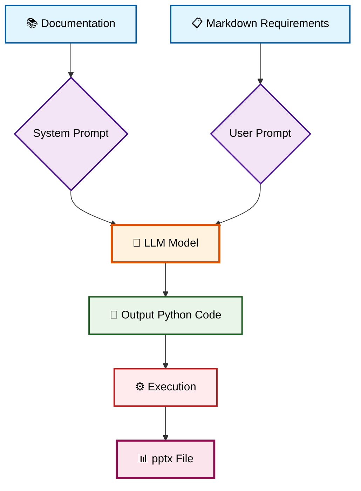

# opengamma

Presentation generation Agent (real **pptx**, not md/latex). Part of [@gamma_gpt_bot](https://t.me/gamma_gpt_bot) system.



## Setup

[install uv](https://docs.astral.sh/uv/getting-started/installation/)

```
uv sync
```

create .env:
```
OPENROUTER_KEY=ключ в чате проекта
```


## Run
```
uv run main.py
```

To enable logging:
```
uv run main.py --log
```

## Experiments

1. Models:
benchmark generation quality across different models

2. Rag:
change how system prompt is constructed in respect to prompt

## Metrics

SR - Success Rate
Out of 100 presentation prompts how many produce valid running python?


## Formal requirements

Название проекта: `python-pptx генерация презентаций в автоматическом режиме по тексту`

Ссылка на github проекта: `https://github.com/gammacodehq/opengamma`

Ссылка на презентацию проекта: `https://docs.google.com/presentation/d/1xNGmIQmVbMGyG5r6yaQFNNY93qbrNZqSkrlWhbbuvyo/edit`
